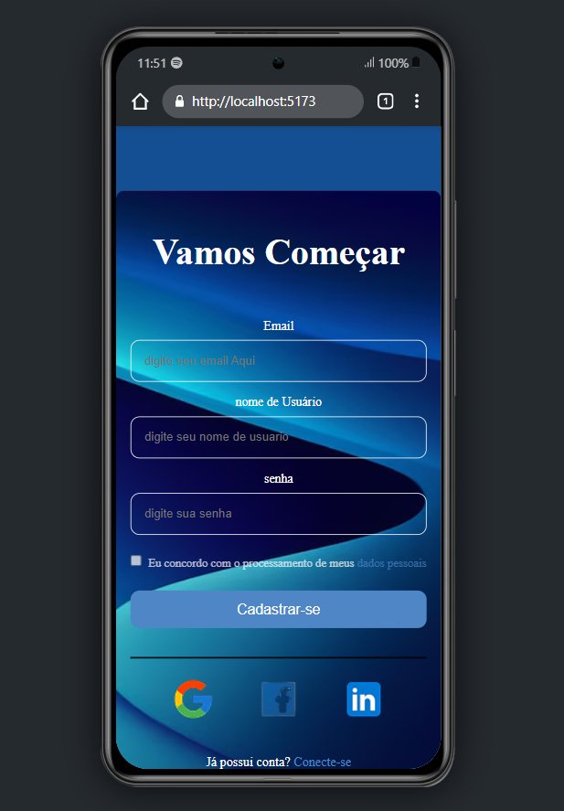
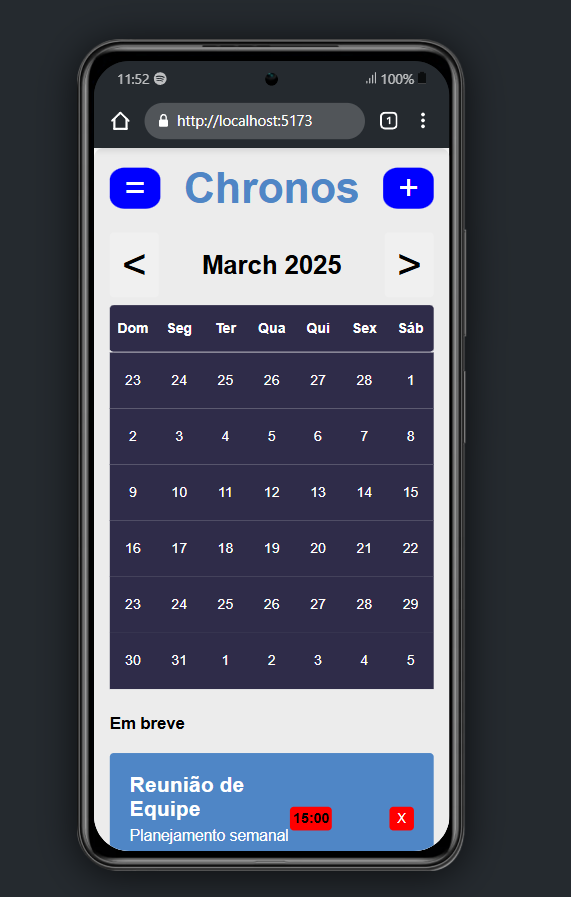
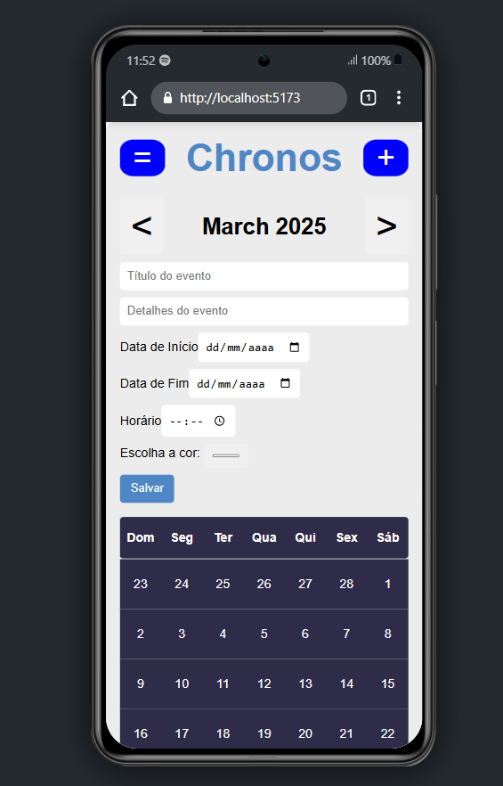

# 📅 Chronos

Chronos é uma aplicação de calendário interativo, inspirada no Google Calendar, que permite aos usuários **visualizar, criar, editar e excluir eventos** de forma simples, rápida e intuitiva.

## ✨ Demonstração

> ⚙️ Protótipo inicial feito no **Figma** ([Link do protótipo](https://www.figma.com/proto/3AEOr4SO2cpNklzroN7B88/Tokenlab-UI?node-id=18-147&t=P04zvQSPuXDkFU7k-1)).  
> 🌐 Link para a aplicação online (deploy) *(em breve)*.

---

## 🚀 Funcionalidades

- ✅ Visualização **mensal, semanal e diária** dos eventos
- ✅ **Adicionar, editar e excluir eventos** com data, hora, título e descrição
- ✅ **Sistema de autenticação** com login e cadastro de usuários
- ✅ Interface **responsiva e intuitiva**
- ✅ **Armazenamento persistente** de dados por usuário

---

## 🛠️ Tecnologias Utilizadas

- **React.js** ⚛️ — Biblioteca principal para construção da interface
- **SCSS (Sass)** 🎨 — Estilização customizada e responsiva
- **React Router DOM** 🔀 — Gerenciamento de rotas e navegação
- **Context API** 📦 — Gerenciamento global de estado
- **Vite** ⚡ — Bundler para desenvolvimento rápido
- **MySQL** 🗄️ — Banco de dados relacional para persistência de dados
- **CORS** 🌐 — Permite requisições entre diferentes domínios (Cross-Origin Resource Sharing)
- **Express** 🚀 — Framework para construir APIs no Node.js
- **Axios** 🌍 — Biblioteca para fazer requisições HTTP 
- **Day.js** 🕒 — Manipulação de datas de forma simples 
- **TUI Calendar** 📅 — Biblioteca para gerenciamento de calendários 

---

## 📸 Layout e Interface

O design do Chronos foi inspirado no Google Calendar, focando na **facilidade de uso e clareza visual**.  

> 🎨 **Responsivo**: Funciona em desktops, tablets e smartphones.  
> 💡 **Moderno e leve**, com foco em usabilidade e acessibilidade.  

---

## ⚙️ Como Rodar o Projeto Localmente

### 1. Clone o repositório:
```bash
git clone https://github.com/seu-usuario/chronos.git
```

### 2. Abra dois terminais:
```bash
cd chronos -> cd client

cd chronos -> cd server
```

### 3. Instale as dependências:
```bash
Instale tanto no server quanto no client

npm install
```

### 4. Inicie o servidor local no client:
```bash
npm run dev
```

### 5. Inicie o banco de dados no XAMPP:
```bash
start Apache
start MySql
```

### 6. Inicie o banco de dados local no server:
```bash
node index.js
```

### 7. Acesse no navegador:
```bash
http://localhost:5173
```





